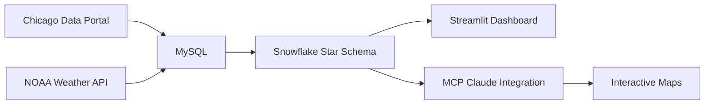

# Surviving Chicago: A Data Engineering Project

<div align="center">


</div>

---

<div align="center">

**A comprehensive data engineering pipeline analyzing 195,259 crimes across 77 Chicago neighborhoods to determine where you'll actually survive.**

**Team:** Adi Singh | Junny Choi | Mike Peng | Wendy Xing

</div>

---

## 🎯 Project Overview

**Problem:** How do you maximize your chances of surviving in Chicago based on neighborhood safety, demographics, business availability, weather patterns, and access to police services?

**Solution:** An end-to-end data engineering pipeline that integrates:
- 📍 195,259+ crime incidents (2025 data from Chicago Data Portal)
- 🏘️ 77 community areas with demographic data
- 🌡️ Daily weather patterns from NOAA NCEI
- 🏢 49,327+ active business licenses
- 👮 Police district boundaries and ward offices

---

## 🏆 Key Findings

<table>
<tr>
<td width="33%" align="center">
<h3>🛡️ 50x Safety Disparity</h3>
<b>Safest:</b> Edison Park<br/>
195 crimes/year<br/>
(1 every 40 hours)<br/><br/>
<b>Most Dangerous:</b> Austin<br/>
9,845 crimes/year<br/>
(1 every 49 minutes)
</td>
<td width="33%" align="center">
<h3>🌡️ 35% Summer Spike</h3>
<b>February (coldest):</b><br/>
15,931 crimes @ 27°F<br/><br/>
<b>July (hottest):</b><br/>
21,473 crimes @ 77°F<br/><br/>
Weather matters!
</td>
<td width="33%" align="center">
<h3>💰 Income ≠ Safety</h3>
<b>Near North Side:</b><br/>
$109K median income<br/>
9,257 crimes<br/><br/>
Business density drives<br/>crime more than wealth
</td>
</tr>
</table>

---

## 🏗️ Architecture


<div align="center">

### Tech Stack

| Category | Technologies |
|----------|-------------|
| **Languages** |   |
| **Data Processing** |   |
| **Databases** |   |
| **Visualization** |    |
| **Tools** |  |
| **AI Integration** |  |

</div>

**Data Flow:**
1. **Extract:** Pull data from Chicago Data Portal & NOAA
2. **Transform:** Data cleaning, normalization, and enrichment with Pandas
3. **Load:** SQLAlchemy loads to MySQL, then migrated to Snowflake
4. **Model:** Snowflake schema with 1 fact table (crime events) and 8 dimension tables
5. **Analyze:** SQL queries via Snowflake MCP integration with Claude AI
6. **Visualize:** Interactive Snwoflake Streamlit dashboard and Geospatial Map with Leaflet.js maps

---

## 📊 Interactive Features

### 🗺️ Geospatial Crime Map
Real-time interactive map powered by **Leaflet.js** with:
- ✅ 22 Chicago neighborhoods with actual lat/long boundaries
- ✅ Color-coded by income, crime rate, violent crime, arrest rate
- ✅ Hover tooltips with detailed statistics
- ✅ Google Maps-style navigation (zoom, pan, rotate)

### 📈 Weather-Crime Correlation Analysis

- Month-by-month crime trends
- Temperature impact visualization
- Seasonal pattern identification
- Interactive hover details

### 🏆 Survival Index Rankings
Data-driven safety scores for all 77 neighborhoods with:
- Multi-factor scoring algorithm
- Comparative visualizations
- Neighborhood recommendations by lifestyle

[**Try the Live Demo →**][https://claude.ai/public/artifacts/08417f93-b8dd-4ef3-80ae-14eca2e08d3d]

---

## 🚀 Getting Started

### Prerequisites
```bash
Python 3.9+
MySQL 8.0+
Snowflake account
Git
```

### Installation
```bash
# Clone the repository
git clone https://github.com/yourusername/surviving-chicago-data-engineering
cd surviving-chicago-data-engineering

# Create virtual environment
python -m venv venv
source venv/bin/activate  # On Windows: venv\Scripts\activate

# Install dependencies
pip install -r requirements.txt
```
---

## 📁 Project Structure
```
surviving-chicago-data-engineering/
│
├── README.md                       # You are here
├── requirements.rtf                # Python dependencies
│
├── data/                           # Data storage
│   ├── raw/                        # Original datasets
│   ├── cleaned/                    # Cleaned data
│   └── README.md                   # Data documentation
│
├── sql/                            # SQL scripts for Schema and Loading Data
|   ├── DDL_crimes.sql              # Schema and Table Creation
│   └── DML_crime.sql               # Loading Data
|
├── snowflake_mcp_server.py         # Snowflake MCP Server Python Script (Claude Desktop Config and MCP Server Setup shown in Local MCP Snowflake Server repo)
│
├── chicago_crime_leaflet_map.html  # Interactive Geospatial Map of Chicago HTML Code
│
├── streamlit_app/                  # Interactive dashboard
│   └── app.py                        # Main application
│
├── Final_Project_Presentation.pdf    # Final presentation - includes business case, data transformation overview and business insights 
```

---

## Skills Demonstrated

This project showcases:

**Data Engineering**
- ETL pipeline design and implementation
- Snowflake schema dimensional modeling
- Data normalization (3NF)
- Database migration (MySQL → Snowflake)
- Data quality validation
- Performance optimization

**Technical Skills**
- Python (Pandas, NumPy, SQLAlchemy)
- SQL (Complex joins, aggregations, CTEs)
- Geospatial analysis
- Statistical analysis and correlation
- Interactive dashboards (Streamlit)

**Data Analysis**
- Exploratory data analysis (EDA)
- Time-series pattern recognition
- Correlation analysis
- Data visualization

**Soft Skills**
- Business problem identification
- Stakeholder communication
- Technical presentation design
- Documentation and code organization
- Team collaboration (4-person team)

---

## 🎯 Use Cases

This framework can be applied to:

- 🏠 **Real Estate:** Identify safe neighborhoods for property investment
- 👮 **Law Enforcement:** Optimize police resource allocation
- 🏢 **Business Planning:** Determine optimal locations for new businesses
- 🏛️ **Policy Making:** Data-driven community development decisions
- 📊 **Urban Planning:** Understand crime-environment relationships
- 👨‍👩‍👧‍👦 **Residents:** Make informed decisions about where to live

---

## 👥 Team

<div align="center">

| Name | LinkedIn |
|------|----------|
| Junny Choi | [LinkedIn](https://www.linkedin.com/in/junnychoi/) 
| Adi Singh | [LinkedIn](https://www.linkedin.com/in/adipsingh) 
| Mike Peng | [LinkedIn](https://www.linkedin.com/in/mike-peng-244237245/) 
| Wendy Xing | [LinkedIn](https://www.linkedin.com/in/wendyxing/) 
</div>

---

## 📊 Data Sources

- [Chicago Data Portal - Crimes 2001-Present](https://data.cityofchicago.org/Public-Safety/Crimes-2001-to-Present/ijzp-q8t2)
- [NOAA NCEI - Weather Data](https://www.ncei.noaa.gov/)
- [Chicago Data Portal - Demographics](https://data.cityofchicago.org/)
- [Chicago Data Portal - Business Licenses](https://data.cityofchicago.org/)

---

## 🙏 Acknowledgments

- **Chicago Data Portal** for providing open access to city datasets
- **NOAA NCEI** for historical weather data

---

## 🌟 Star This Repo!

If you found this project helpful or interesting, please consider giving it a ⭐!

---

<div align="center">
